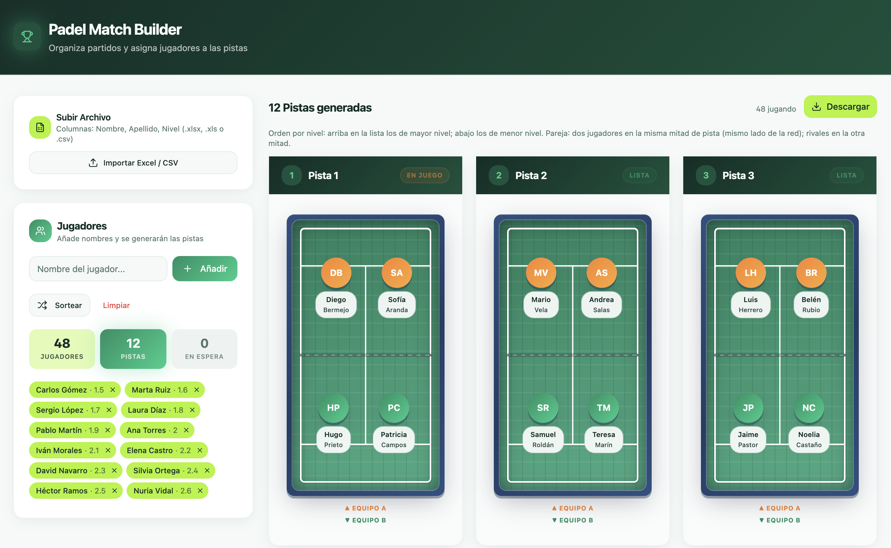
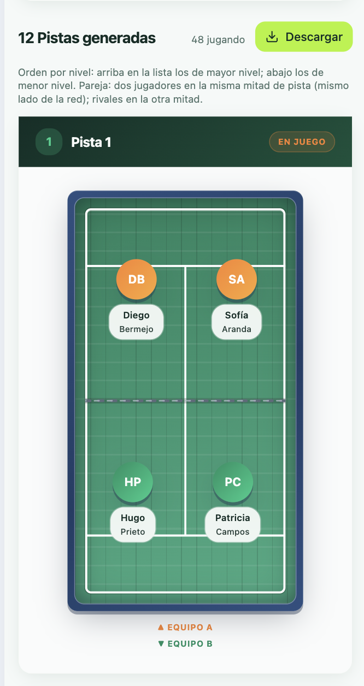

# Padel Match Builder

**Herramienta para organizar tus pozos de pádel.** Subes **un solo archivo Excel** (o CSV) con la lista de jugadores y sus niveles, y obtienes **todas las pistas asignadas** al momento: parejas rivales claras y distribución ordenada por nivel, sin hojas de cálculo manuales ni sorteos en papel.

Ideal para clubes, torneos abiertos o quedadas donde hay que repartir a todo el mundo en pistas de 4 jugadores de forma rápida y coherente.

**App en vivo (Vercel):** [https://padel-pairings.vercel.app/](https://padel-pairings.vercel.app/)

---

## Qué hace esta app

1. **Importas** tu archivo con columnas **Nombre**, apellidos y nivel (ver tabla más abajo); opcionalmente **ParejaID** para fijar parejas.
2. La app **agrupa de 4 en 4** para formar pistas (2 parejas rivales por pista).
3. **Ordena por nivel** al importar: sin parejas fijas, jugador a jugador; con **ParejaID**, cada pareja se posiciona según el **promedio** de los dos niveles (si difieren). En pantalla, las pistas más fuertes quedan arriba en la lista.
4. Puedes **añadir o quitar jugadores** a mano, **sortear** el orden si quieres aleatoriedad, o **limpiar** y empezar de nuevo.

### Capturas (demo)

<p align="center">
  <strong>Demo</strong><br />
  <br /><br />
  <strong>Demo 2</strong><br />
  
</p>

Todo ocurre en el navegador; no hace falta instalar nada más que el navegador para usar la versión desplegada.

---

## Formato del archivo de importación

La app lee **la primera hoja** del libro (por ejemplo `Hoja1`). La primera fila debe ser **cabecera** con nombres de columnas.

### Plantilla del formato actual: `jugadores_padel_48_personas_y_pareja.xlsx`

En la **raíz del repositorio** tienes un Excel listo para importar que cumple el **formato nuevo** (no es solo “nombre + apellido + nivel”):

| Detalle | Qué incluye |
|--------|----------------|
| **Cabeceras** | `Nombre`, `Apellidos`, **`Nivel Playtomic`**, **`ParejaID`** |
| **Nivel** | Columna de nivel en la tercera columna de datos (`Nivel Playtomic`); decimales con **coma** o punto (`2,55`). |
| **ParejaID** | Opcional por fila. El mismo número en **dos filas** = esa pareja **siempre junta** en una mitad de pista; pueden tener nivel distinto (la app usa el **promedio** para ordenar en qué pista van). Quienes van **sin** `ParejaID` se emparejan entre sí (en número par si hay algún ID fijo en el archivo). |
| **Tamaño** | **48 jugadores** en el ejemplo (12 parejas con ID + 24 sin ID emparejados entre sí). |

Descarga directa desde GitHub:  
[jugadores_padel_48_personas_y_pareja.xlsx](https://github.com/kaluli/padel-pairings/raw/main/jugadores_padel_48_personas_y_pareja.xlsx)

El archivo **`Orden pistas.xlsx`** sigue siendo válido como ejemplo más simple (columnas clásicas **Nombre**, **Apellido**, **Nivel** sin `ParejaID`).

### Columnas de datos (nombres aceptados)

| Columna | Alias reconocidos | Descripción |
|--------|-------------------|-------------|
| **Nombre** | — | Nombre del jugador (obligatorio para no saltar la fila). |
| Apellidos | **Apellido**, **Apellidos** | Apellido(s). Puede ir vacío; el nombre mostrado es nombre + apellidos. |
| Nivel | **Nivel**, **Nivel Playtomic** | Valor numérico (ej. `1.5`, `2`, `2,55`). **Coma o punto** como decimal (`1,6` ≡ `1.6`). |
| *(opcional)* **ParejaID** | **Pareja Id**, **Pareja** | Mismo número en **dos filas** = esas dos personas juegan siempre **en la misma mitad de pista** (misma pareja). Pueden tener niveles distintos: para decidir en qué pista va la pareja se usa el **promedio** de los dos niveles. Las filas **sin** `ParejaID` se emparejan entre sí por orden de nivel (de dos en dos). |

Otras columnas extra (por ejemplo **Nº** o **Pista**) **se ignoran** para el cálculo.

### Validación cuando usas `ParejaID`

- Cada valor de **ParejaID** debe aparecer **exactamente dos veces** (una pareja).
- Si en el archivo hay **al menos un** `ParejaID`, los jugadores **sin** `ParejaID` deben ser **en número par** (para cerrar parejas entre ellos).

### Ejemplo de filas válidas

Sin pareja fija:

| Nombre | Apellidos | Nivel Playtomic |
|--------|-----------|-----------------|
| Carlos | Gómez | 1.5 |
| Marta | Ruiz | 1,6 |

Con parejas (mismo `ParejaID` = misma pareja):

| Nombre | Apellidos | Nivel Playtomic | ParejaID |
|--------|-----------|-----------------|----------|
| Ana | López | 2.8 | 1 |
| Luis | Díaz | 2.2 | 1 |

Para ordenar la pareja del ejemplo en la lista de pistas se usa el promedio `(2.8 + 2.2) / 2`.

### Reglas prácticas

- **Formatos**: `.xlsx`, `.xls`, `.csv`.
- Se omiten las filas **sin nombre ni apellido** (vacías).
- Debe haber **al menos un nivel válido** en el conjunto; si ninguna fila tiene nivel interpretable como número, la importación falla.
- Cada **4 jugadores** forman una pista completa (2 parejas rivales). Los que sobran aparecen en **En espera**.

**Resumen:** usa **`jugadores_padel_48_personas_y_pareja.xlsx`** como referencia del formato ampliado; **`Orden pistas.xlsx`** como ejemplo mínimo sin parejas fijas.

---

## Desarrollo local

```bash
npm install
npm run dev
```

El puerto de desarrollo está en `vite.config.ts` (por defecto **5173**). Si el puerto estuviera ocupado, Vite propondrá otro y lo mostrará en la consola.

## Build

```bash
npm run build
```

Salida en la carpeta `dist/`.

## Despliegue

La versión publicada está en **[padel-pairings.vercel.app](https://padel-pairings.vercel.app/)**.

El proyecto incluye `vercel.json` pensado para **Vite + React Router** en [Vercel](https://vercel.com).
